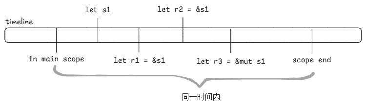
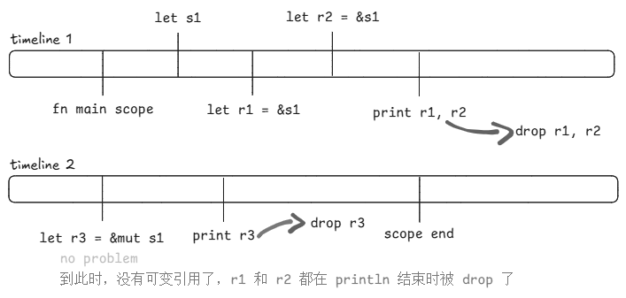

接着，我们将所有权中最重要的一个：借用和引用。

:::blockquote
在 Rust 中，借用和引用都是在描述同一个特性：借用。借用（Borrowing）是在描述一种行为，而引用（Reference）则是在描述一种数据类型。它们就像一个两面硬币，转来转去但本质都是同样的特性。
:::

## 引用与解引用

常规引用是一种指针类型，它存储了一个变量的内存地址，可以通过解引用来访问这块内存的值。所有数据类型都可以通过加上 `&` 变成一个引用类型，我们先看一段代码：

```rust
fn main() {
  let s1: String = String::from("hello, ");
  let result = append_string(s1);
  
  println!("result: {}, s1: {}", result, s1); // [!code error]
}

fn append_string(mut s: String) -> String {
  s.push_str("world!");
  s
}
```

在这段代码中，我们声明了一个字符串变量 `s1`，然后把它传给了 `append_string`，接着，我们分析一下 `append_string` 的函数签名：

- 参数 `mut s: String`：它接受了一个可变参数 `s`，类型是 `String`
- 返回值 `String`：它最后会返回一个 `String` 类型的返回值

接着，我们看看函数体，它内部是如何实现的。可以看到，我们对 `s` 字符串调用了 `push_str` 函数，这个函数你可以传入一个字符串字面量，它会把这个字面量加入到这个变量当中。
最后我们返回这个 `s`。

但是代码报错了，位置在第 5 行。

这是因为，我们把 `s1` 作为参数传入到了 `append_string` 函数当中，这会导致这个字符串的所有权从 `s1` Move 到了函数参数 `s`
当中。当函数结束时 `s` 退出作用域，然后被 drop。结果是，`s1` 不再拥有所有权，在后面自然就不能被访问了，我们看看报错内容：

```text
error[E0382]: borrow of moved value: `s1`
 --> src\main.rs:5:42
  |
2 |   let s1: String = String::from("hello, ");
  |       -- move occurs because `s1` has type `String`, which does not implement the `Copy` trait
3 |   let result = append_string(s1);
  |                              -- value moved here
4 |   
5 |   println!("result: {}, s1: {}", result, s1);
  |                                          ^^ value borrowed here after move
  |
```

如果我们非不使用 `clone` 呢？虽然我们可以把代码改成 `let result = append_string(s1.clone())`，但是很显然，要是最优解法真是这样的话，Rust
就无需研究什么引用与借用了。

我们只需要简单的改一下代码，就可以不用 `clone`，而且不会再报错了：

:::code-group
```rust [对比]
fn main() {
  let s1: String = String::from("hello, "); // [!code --]
  let result = append_string(s1); // [!code --]
  let mut s1: String = String::from("hello, "); // [!code ++]
  append_string(&mut s1); // [!code ++]
  
  println!("result: {}, s1: {}", result, s1); // [!code --]
  println!("s1: {}", s1); // [!code ++]
}

fn append_string(mut s: String) -> String { // [!code --]
  s.push_str("world!") // [!code --]
  s // [!code --]
fn append_string(s: &mut String) -> () { // [!code ++]
  (*s).push_str("world!") // [!code ++]
}
```
```rust [最终结果]
fn main() {
  let mut s1: String = String::from("hello, ");
  append_string(&mut s1);
  
  println!("s1: {}", s1);
}

fn append_string(s: &mut String) -> () {
  (*s).push_str("world!")
}
```
:::

主要修改的地方是：不再需要 `result` 去接受最终参数，而是将 `s1` 作为一个可变的变量，并且在接受参数时，使用**可变引用**（`&mut String`），最后，也无需返回值，
`push_str` 修改的是堆内存上的值，这里我们对 `s` 解引用，可以直接访问到堆上的值。

你看，不仅代码更加具有 Rust 风味，而且还剩下了 `result` 和 `clone` 一个 `s1` 的开销，我们可以对比一下：

:::code-group
```rust [使用 clone]
fn main() {
  let s1: String = String::from("hello, ");
  let result = append_string(s1.clone());
  
  println!("result: {}, s1: {}", result, s1);
}

fn append_string(mut s: String) -> String {
  s.push_str("world!")
  s
}
```
```rust [使用借用与引用]
fn main() {
  let mut s1: String = String::from("hello, ");
  append_string(&mut s1);
  
  println!("s1: {}", s1);
}

fn append_string(s: &mut String) -> () {
  (*s).push_str("world!")
}
```
:::

## 不可变引用和可变引用

在代码中的体现，可变引用和不可变引用的区别就是 `mut` 关键字：

```rust /mut/
fn main() {
  let mut s1 = String::from("abc");
  
  let r1 = &s1;
  let r2 = &mut s1;
}
```

需要注意的是，如果你想声明可变引用的话，那么原变量必须也是可变的。

还有，引用存在一个特点：在同一周期内，原变量要么**有数个不可变引用，没有可变引用**；要么**只有一个可变引用，没有其他引用**。

例如，在同一周期内，我可以声明数个不可变引用：

```rust
fn main() {
  let mut s1 = String::from("abc");
  
  let r1 = &s1;
  let r2 = &s1;
  let r3 = &s1;
  
  println!("{r1}, {r2}, {r3}");
}
```

这段代码不会报错，运行后输出：`abc, abc, abc`。或者是，在同一周期内，我只有一个可变引用，同时没有其他引用（包括不可变引用）：

```rust
fn main() {
  let mut s1 = String::from("abc");
  
  let r1 = &mut s1;
  
  r1.push_str("def");
  
  println!("{r1}");
}
```

这段代码会输出 `abcdef`。

如果我们在同一周期内，有两个可变引用，或者在有一个可变引用的情况下，有不可变引用呢？

:::code-group
```rust [有两个可变引用]
fn main() {
  let mut s1 = String::from("abc");
  
  let r1 = &mut s1;
  let r2 = &mut s1; // 报错 // [!code error]
  
  r1.push_str("def");
  r2.push_str("ghi");
  
  println!("{r1}, {r2}");
}

/* 报错内容：
 * error[E0499]: cannot borrow `s1` as mutable more than once at a time
 * --> src\main.rs:5:12
 *   |
 * 4 |   let r1 = &mut s1;
 *   |            ------- first mutable borrow occurs here
 * 5 |   let r2 = &mut s1;
 *   |            ^^^^^^^ second mutable borrow occurs here
 * 6 |   
 * 7 |   r1.push_str("def");
 *   |   -- first borrow later used here
 */
```
```rust [有一个可变引用和数个不可变引用]
fn main() {
  let mut s1 = String::from("abc");
  
  let r1 = &s1;
  let r2 = &s1;
  let r3 = &mut s1; // 报错 // [!code error]
  
  r3.push_str("def");
  
  println!("{r1}, {r2}, {r3}");
}
/* 报错内容：
 * error[E0502]: cannot borrow `s1` as mutable because it is
 *               also borrowed as immutable
 *   --> src\main.rs:6:12
 *    |
 *  4 |   let r1 = &s1;
 *    |            --- immutable borrow occurs here
 *  5 |   let r2 = &s1;
 *  6 |   let r3 = &mut s1;
 *    |            ^^^^^^^ mutable borrow occurs here
 * ...
 * 10 |   println!("{r1}, {r2}, {r3}");
 *    |              -- immutable borrow later used here
 */
```
:::

两个报错分别是 `E0499` 和 `E0502`，分别是：

1. `E0499`: <code>cannot borrow \`s1\` as mutable more than once at a time</code>，不能在同一时间内多次将 `s1` 作为可变对象借用
2. `E0502`: <code>cannot borrow \`s1\` as mutable because it is also borrowed as immutable</code>，无法将 `s1` 作为可变对象借用，因为它在同一时间内被作为不可变对象借用

那么什么是同一时间呢？我们可以理解为，从作用域开始到变量声明时这一段时间：



我们发现，在同一时间内，存在 `r1`、`r2`、`r3` 三个引用（r3 还是可变引用）。为什么我们不能这么做？这很简单，因为这会导致数据竞争，最终会有未定义行为，导致程序崩溃。

> [!TIP] 数据竞争
> 
> 数据竞争（Data Race）是多线程编程（Rust 是一门多线程语言）中的一种经典错误。当两个或更多的线程同时访问同一个内存地址，且至少有一个线程在进行**写（Write）**操作，同时这些访问没有通过同步机制（如锁）来协调时，数据竞争就发生了。
> 
> 简单来说，它就像是两个人在**没有沟通**的情况下，试图**同时涂改同一张纸上的同一个字**。

如果我们稍稍改一下代码：

```rust
fn main() {
  let mut s1 = String::from("abc");
  
  let r1 = &s1;
  let r2 = &s1;
  println!("{r1}, {r2}");
  
  let r3 = &mut s1;
  
  r3.push_str("def");
  
  println!("{r3}");
}
```

为什么行？我们再画一个时间线看看:



`println` 需要传入参数，而我们的参数 `r1`、`r2` 在传入后，就不再拥有所有权（被作为 `println` 的参数转移了），然后 `println` 的函数作用域退出后，`r1` 和 `r2` 就会被 `drop`。
也就是说在往后的时间线中，`s1` 已经没有引用了。

## 悬垂引用

悬垂引用（Dangling References）也可以叫做悬垂指针，意思是，当某个指针指向的值被释放掉后，然而指针仍然存在，其指向的内存可能不存在任何值或已被其它变量重新使用。
在别的语言中（例如 C、C++），这是个运行时错误，然而 Rust 编译器会在编译时期就检查出这个错误：

```rust
fn main() {
  let reference_to_nothing = dangle();
}

fn dangle() -> &String { // [!code error]
  let s = String::from("hello");
  &s
}
```

报错内容是：

```text
error[E0106]: missing lifetime specifier
 --> src\main.rs:5:16
  |
5 | fn dangle() -> &String {
  |                ^ expected named lifetime parameter
  |
```

我们不妨研究一下这个函数：

```rust
fn dangle() -> &String {
  let s = String::from("hello"); // 变量 s 被声明
  &s // 返回变量 s 的引用
} // s 退出作用域，s 被 drop，内存被清理
  // 但是引用被作为函数返回值返回了，这就导致 &s 指向了一个被清理的内存
```

最简单的修复方式，就是不要这个引用了（生命标识符我们在后面才会讲解，目前不做考虑）：

```rust
fn dangle_fixed() -> String {
  let s = String::from("hello");
  s
}
```