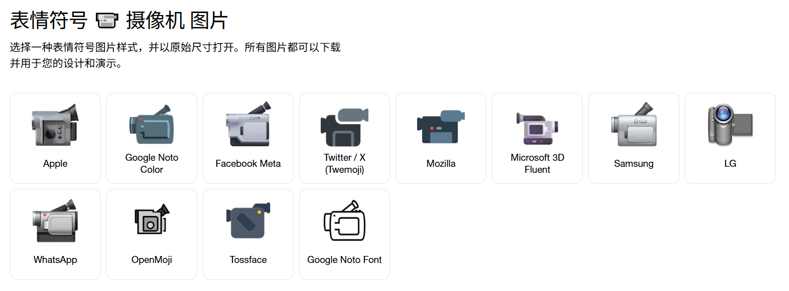

和其他语言不同，Rust 的字符串是很复杂的，如果你是从别的语言转型过来学习 Rust 的话，像是什么 Java、JavaScript、C++ 之类的，对于这些语言而言，字符串可能只是简简单单的一句
`"Hello, World!"` 就能概括的。然而 Rust 完全相反。

这份复杂性其实正是源于 Rust 的核心特性：**所有权**。

---

我们说过，Rust 没有 GC（Garbage Collection，垃圾回收），所有变量在何时清理、堆上的某一块内存在何时释放都是在编译时期确定下来的，也正因为如此，
存储在堆上的字符串，就必须有足够多的约束、有足够多的条件去支撑它不会出现错误。Rust 在开发字符串时，会告诉你：
**这段文字在哪（栈或者堆）？谁拥有它？它能存活多久？**

## 字符的存储

在进入 Rust 代码之前，我们先得搞懂计算机是如何存储一段文字的，这里我们要讲两个概念：字符集和字符编码。

### 字符集

字符集（Character Set），如名字一样，它是一个巨大的集合（映射表），用于存储文字、特殊字符、Emoji 等等，例如国内制作的 GB2312、ASCII
等。

#### Unicode 字符集

目前世界公认最常用、最有用的字符集是 Unicode，也被称作 “万国码”，它是最全面的字符集，几乎包含了世界上现用的所有字符。Unicode
为每一个字都分配了一个码点*（Code Point / Unicode 的码点也叫做 Unicode 码点，当然所有字符集都会分配码点）*，每一个码点会映射到具体的一个字上。

例如 `爱` 字，在 Unicode 当中，`爱` 的码点是 `U+7231`。（注意，`U+` 后方的数字是十六进制）

然而，光要字符集还不够，我们知道，计算机当中存储数据都是采用的二进制。所以，我们需要一个东西，能够把字符集的码点转换成一个二进制，这个就是字符编码（Character Encoding）。

### 字符编码

我们知道，电脑存储数据都是 0 和 1，像 `爱` 这个字，该怎么存到电脑中呢？这就需要通过字符编码（Character Encoding）了，字符编码可以将一段码点转换成二进制，或者将一段二进制转换成码点。

不过需要注意的是，字符编码和字符集是非常自私的，它们通常互不兼容，即使是同一个字符集，但是使用不同的字符编码去解码文本可能会出现乱码的情况。这是因为字符编码的工作原理不同导致的。

例如 UTF-8 编码的文本不能使用 UTF-16 解码，即使它们都是 Unicode 的编码规则。但是 UTF-8、UTF-16、UTF-32 解编码（都使用同一种字符编码去解码、编码）的最终结果是相同的，因为它们都是基于
Unicode 字符集的，即最终的码点是一样的。

#### UTF-8 字符编码

同样的，目前也有一个最常用、最好用的字符编码：UTF-8 （8-bit Unicode Transformation Format，8 位 Unicode 转换格式）。它采用了动态的编码，一个字符可以用
1 到 4 个字节去表示。如果使用纯英文写文件，UTF-8 (纯英文情况下每个字符只需要一个字节) 能够比 UTF-16 (一个字符通常需要 2 个字节)，要小上一半。

##### UTF-8 的工作原理

UTF-8 为了实现动态大小，它制作了一个编码规则：

| 字符范围 (十六进制)      | 字节数 | 格式 (二进制)                              |
|------------------|-----|---------------------------------------|
| `0000 - 007F`    | 1   | `0xxxxxxx`                            |
| `0080 - 07FF`    | 2   | `110xxxxx 10xxxxxx`                   |
| `0800 - FFFF`    | 3   | `1110xxxx 10xxxxxx 10xxxxxx`          |
| `10000 - 10FFFF` | 4   | `11110xxx 10xxxxxx 10xxxxxx 10xxxxxx` |

###### 编码

编码也就是通过码点转换成二进制。

> [!TIP] 码点是怎么来的？
> 
> 一个字被输入进来，你有没有好奇它是怎么从一个字变成一个码点的？例如我输入一个 `爱` 字，计算机只认识 0 和 1，那它又是怎么把这个字转换成码点的？
> 
> 这就要提到一个我们经常忽略的角色了，即使它一直都存在，但是我们总是会忘了它的巨大贡献 —— 输入法
> 
> 输入法内部有一个输入转换引擎（IME，Input Method Engine），它的作用是将基本的拉丁字母表组合转换成具体的文字，例如中文输入法输入 `ai`，它就会检索匹配这个拼音的汉字，
> 像是 `爱、哎、唉、艾`，有的输入法还会给你做出一些组合，例如 `爱人、爱心`，或者一个 Emoji `💗` 等等。不过它们的原理是一样的，就是通过拉丁字母，在一个巨大的数据库中检索匹配，
> 得到最终结果。
> 
> 在这些结果中，我们选择 `爱` 字按下回车，输入法会帮我们把这个字的码点找到，然后转换成二进制。通常，都采用 UTF-8 格式编码。

在拿到码点的时候（例如 `U+7231`），UTF-8 会先看这个码点在那个区间范围内，很显然是 `0800 - FFFF` 这个区间里，所以这个字符有 3 个字节。

接着，就需要一位一位的去把这个十六进制转换成二进制，编码需要使用具体的模板，3 个字节的模板是 `1110xxxx 10xxxxxx 10xxxxxx`，只需要把 `x`
的内容替换成具体的值即可，我们需要对 `7231` 每一位转换成二进制：

- `7` -> `0111`
- `2` -> `0010`
- `3` -> `0011`
- `1` -> `0001`

然后把它们替换到 `x` 当中，变成：`11100111 10001000 10110001`，这样就可以存到电脑当中了。

###### 解码

比如说，我们拿到了一个文件，文件的二进制是：

```text
# UTF-8 编码
11100110 10001000 10010001 11100111 10001000 10110001 11100100
10111101 10100000
```

这里有几个字？它们分别是什么？计算机是怎么知道的呢？

我们可以回到 UTF-8 的编码规则，我们发现，想要区分一个字从哪到哪非常简单，那就是看开头：

- 一个字节的：开头是 `0`
- 两个字节的：开头是 `110`
- 三个字节的：开头是 `1110`
- 四个字节的：开头是 `11110`

也就是，我们只需要去寻找 `0`、`110`、`1110`、`11110` 四个开头，就能分割往后的每一个字符，我们来分割一下：

```text
11100110 10001000 10010001 # E6 88 91
11100111 10001000 10110001 # E7 88 B1
11100100 10111101 10100000 # E4 BD A0
```

我们发现，这里有三个字。接着，我们需要把它们转换成 `U+XXXX` 的格式，只需要把具体的值从模板里拿出来就行，例如第一个：

- `11100110 10001000 10010001`，模板是 `1110xxxx 10xxxxxx 10xxxxxx`， 我们把 `x` 的部分拿出来：`0110 0010 0001 0001`，也就是 `6211`

不过就不用大家一一去算了，答案是：

- `U+6211`
- `U+7231`
- `U+4F60`

接着，我们在 Unicode 字符集当中寻找这三个字，它们对应了：`我`、`爱`、`你`

## 字符串字面量

接下来，我们进入到代码当中，去了解 Rust 中的文字是如何存储的，以及文字的类型。

首先，我们有一个最简单的字符串 —— 字符串字面量：

```rust
let s1 = "Rust";
```

如果你有智能 IDE，你可以知道 `s1` 的类型是 `&str`，它是一个引用类型，原始类型是 `str`。这个类型是我们目前为止学到的第一个较为复杂的类型，我们一起看看：

```rust
let s1: &str = "Rust";
```

首先我们可以观察到，这个变量的类型很特殊，因为它默认是一个引用类型，是对 `str` 的引用，为什么不直接用 `str` 呢？

这里，我们需要引入一个新的概念：动态大小类型（DST，Dynamically Sized Types）。

### 动态大小类型

动态大小类型指的是**在编译时期无法确定具体占多少内存字节**的类型。在 Rust 中，最常见的动态大小类型就是 `str`，例如：

- `hi`：2 个字节
- `你好`：6 个字节

由于 `str` 的长度可以任意，编译器无法预先知道 `s: str` 占多大地方，所以你不能直接声明 `let s: str;`。

我们再考虑下面几个问题：

1. 为什么需要动态大小类型
2. 动态大小类型存在哪里
3. `String` 是动态大小类型吗？

#### 为什么需要动态大小类型

（我们主要考虑 `str`）动态大小类型是为了解决两个问题：

1. **处理不同来源的数据**。文字可不是只会存在于堆上的，栈上、静态内存、只读区，只要是有 UTF-8 编码的地方就可以是一段文字。String 只处理堆上的那段文字。
2. **性能**。如果说在处理一段文字时，它有 1MB 大小，如果使用 String，那就需要把这段文字给**拷贝**下来，这是很大的消耗。如果使用 `&str` 呢？它是一个引用类型，说明它这个指针指向了 1MB 那块内存，拥有读的权利。

---

#### 动态大小类型存在哪里

动态大小类型没有一个固定的存储位置，他可以出现在任何地方，不过有一个类型是可以确定的，那就是动态大小类型的引用类型，例如 `&str`，它是一个胖指针（Fat Pointer），存储于栈上。

##### 胖指针

胖指针还有另一个称呼，叫做内存视图，胖指针不拥有数据的所有权，但是有数据的查看权利，它主要由两个部分组成：

- 数据的起始地址（Pointer）：从哪开始看
- 数据的长度（Length）：能看多远

有了胖指针，无论数据存储在栈、堆、静态内存还是各种区内，都可以以一种统一的方式去读取它们。例如我们只需要接受 `&str` 而无需关系它们存在于何处。

---

#### String 是动态大小类型吗

首先，我们需要在回顾一下动态大小类型的定义 —— 编译时期不确定值的大小。所以，String 是动态大小类型吗？
答案是**不是**，String 不是一个动态大小类型。这或许很反直觉，明明我们在编译时期的确无法确定 String 的大小，明明它的数据存储与堆上。

事实上，String 是一个结构体，它的大小是固定的，它是由 `Pointer`、`Length`、`Capacity` 三个值组成的，在内存中，它们三者各占 8 个字节，一共是
24 字节。而**指针指向的堆上的数据**大小是不确定的。

## 字符串切片

我们来看看什么是字符串切片，它需要用到我们之前学过的 Range 语法：

```rust
let s1: &str = "Hello, World!";
let s2: &str = &s1[..5]; // [0, 5)
```

`s2` 的值是 `Hello`。

需要注意的是，字符串字面量也是字符串切片。

> [!WARNING] 注意！
> 
> 字符串切片是根据字节来定位的，如果你不清楚一个字符会占用多少个字节，请慎用！
> 
> ```rust
> let s1: &str = "你好！";
> let s2: &str = &s1[..2];
> ```
> 
> 这段代码会在**运行时报错**！报错内容是：
> 
> <code>byte index 2 is not a char boundary; it is inside '你' (bytes 0..3) of \`你好！\`</code>

## String 字符串

接着，是我们的重头戏 —— String 字符串类型。

### String 与 &str

它们两者的区别我们已经提到过了，我们来看看该如何将他们互相转换：

```rust
// 将 &str 转换成 String
let string_1: String = String::from("Hello, World!");
let string_2: String = "Hello, World!".to_string();

// 将 String 转换成 &str
let raw: String = String::from("Hello, World!");
let str_1: &str = &raw; // 最常用
let str_2: &str = &raw[..]; // RangeFull
let str_3: &str = raw.as_str(); // 最常用
```

> [!WARNING] 你不能通过索引访问字符串的对应字符
> 
> ```rust
> let raw = String::from("Hello, World!");
> // let index = raw[0]; // ❌ // [!code error]
> let slice = &raw[..1]; // ✅
> ```

### String 的存储

在 Rust 内部，String 字符串的本质其实是一个 `u8` 类型的数组，u8 类型能存储的范围是 00 到 FF (255)，刚好满足 Unicode 一个字节的存储需求。例如：

```rust
let s1: String = String::from("Rust");
```

这段 String 文本在 Rust 的内部存储是：`[82, 117, 115, 116]`，我们可以用下面这段代码查看：

```rust
fn main() {
  let s1: String = String::from("Rust");
  print!("{:?}", s1.bytes());
}
```

通过 `bytes` 查看每一个字节。我们再举一个例子，看看大家是否记得我们先前提到的字符编码 UTF-8 的特性：

```rust
let s: String = String::from("你好Rust");
```

请问，`"你好Rust"` 一共有几个字节？==答案是 10 个，你答对了吗？==

当然，字符串可以存储任何 Unicode 字符，Unicode 字符包含什么呢？各国语言、特殊字符，甚至是一个 Emoji，我们来打印看看 `📹` 的 bytes:

```rust
fn main() {
  let s1: String = String::from("📹");
  print!("{:?}", s1.bytes());
}
```

这个 Emoji 的 bytes 是：`240, 159, 147, 185`。

> [!TIP] 尝试一下
> 
> 我们尝试把这些 bytes 转换成 `U+` 的格式，首先，我们需要把它转换成二进制：
> 
> - `240`: `11110000`
> - `159`: `10011111`
> - `147`: `10010011`
> - `185`: `10111001`
> 
> 然后 `x` 从四位模板中提取出来，结果是：`000` + `011111` + `010011` + `111001` = `0001_1111_0100_1111_1001`。接着，我们按 4 位一个计算每一位的值：
> 
> - `0001` -> `1`
> - `1111` -> `F`
> - `0100` -> `4`
> - `1111` -> `F`
> - `1001` -> `9`
> 
> 最后的结果是：[`U+1F4F9` 点击查看结果](https://symbl.cc/cn/search/?q=1f4f9)，和我们输入的 📹 一样
>
> (不同字体渲染的 Emoji 效果不同，不过即使样式不同，它们的 Unicode 码点还是一样的)
> 
> 

### 操作 String 字符串

受限于篇幅，这里不讲太多 String 上的方法，我们只讲字符串常用的五种操作：

1. 追加（push）
2. 插入（insert）
3. 替换（replace）
4. 删除（delete）
5. 连接（concatenate）

```rust
fn push() {
  println!("========== push ==========");
  
  /*
   * push 操作会修改原字符串，而非返回一个新的字符串
   * 所以注意 mut 关键字
   */
  let mut raw = String::from("Hello");
  println!("raw: {}", raw);
  
  // 追加单个字符
  raw.push(',');
  println!("追加单个字符 (push): {raw}");
  
  // 追加 &str
  raw.push_str(" World!");
  println!("追加一段文本 (push_str): {raw}");
}

fn insert() {
  println!("======== insert ==========");
  
  // 同样需要 mut 关键字
  let mut raw = String::from("It's ");
  println!("raw: {}", raw);
  
  // insert 需要提供两个参数：index 和 value
  raw.insert(5, 'M');
  println!("插入单个字符 (push): {raw}");
  
  raw.insert_str(6, "yGo!!!");
  println!("插入一段字符 (push_str): {raw}");
}

fn replace() {
  println!("======== replace ==========");
  
  let mut raw = String::from("Hello, World! Hello, Rust!");
  println!("raw: {}", raw);
  
  // replace 传入指定字符，后者替换前者，返回一个新的字符串
  let replace = raw.replace("Hello", "Hi");
  println!("replace: {}", replace);
  
  // replacen 可以替换指定个匹配的结果，返回一个新的字符串
  let replace = raw.replacen("Hello", "Hi", 1);
  println!("replace: {}", replace);
  
  // replace_range 可以替换一段文本
  // 这个函数不返回新字符串，而是在原字符串上修改
  raw.replace_range(
    0..5 /* Hello */,
    "Hi"
  );
  println!("raw: {}", raw);
}

fn delete() {
  println!("======== delete ==========");
  let mut raw = String::from("Hello, World!");
  println!("raw: {}", raw);
  
  // pop 返回字符串的最后一个字符（无论它几个字节）
  // 它返回一个 Option<char>，Option 这个类型我们马上学习
  let p1 = raw.pop();
  let p2 = raw.pop();
  println!("p1: {:?}, p2: {:?}, raw: {}", p1, p2, raw);
  
  // remove 删除指定位置的字符，并且返回它
  let mut raw = String::from("你好，World!");
  let removed = raw.remove(3);
  println!("raw: {}, removed: {}", raw, removed);
  // 需要注意的是，这里的指定位置是字符在内存中的起始字节位置
  // 例如删除 `好` 字，它的起始位置是 3
  
  // truncate 删除指定位置以及往后的字符
  let mut raw = String::from("你好，World!");
  raw.truncate(6);
  println!("raw: {}", raw);
  
  // clear 清空一个字符串
  raw.clear();
  println!("raw: {}", raw);
}

fn concatenate() {
  println!("======== concatenate ========");
  
  let s1 = String::from("你");
  let s2 = String::from("好");
  
  // 通过 + / += 进行连接
  let s3 = s1.clone() + &s2; // 加法后面需要是 &str
  let mut s4 = s3.clone() + "！";
  s4 += "世界！";
  println!("s3: {}, s4: {}", s3, s4);
  
  // 通过 format 拼接
  let s5 = format!("{}{}, {}", s1, s2, "世界！");
  println!("s5: {}", s5);
}

fn main() {
  push();
  insert();
  replace();
  delete();
  concatenate();
  
  // 遍历字符串
  let raw = String::from("中国人");
  
  println!("chars in {raw}");
  
  for c in raw.chars() {
    println!("{c}");
  }
  
  println!("bytes in {raw}");
  
  for c in raw.bytes() {
    println!("{c}");
  }
}
```

尝试运行这段代码，看看结果吧！

---

这节课内容很多，接下来，我们做一个总结！

## 总结

- 字符集和字符编码：字符集是一个巨大的映射，存储了许多文字，字符编码则是将字符集的某个码点转换成二进制。
  - 世界上常用的字符集是 Unicode，常用的字符编码是 UTF-8
  - 不同的字符编码互不支持，例如 UTF-8 编码的文件不能用 UTF-16 解码
  - UTF-8 采用了可变的字符长度，例如：英文为 1 个字节、中文为 3 个字节等
  - Rust 中的文字采用的是 UTF-8 编码
- `&str` 是一种胖指针（`str` 的引用类型），指向了一段文本。这个胖指针也被称作内存视图，拥有只读的权限（不能写）。
  - `&str` 本质就是一段字符串切片
  - `str` 是一个可变大小类型，它的大小在编译时期是未知的，通常出现是在引用的情况下。
  - `String` 不是一个胖指针，而是一个结构体，它存储与栈上，内容包含了一个指针指向堆上的内存。
- `String` 和 `&str` 可以互相转换
  - `String` -> `&str` (`raw: String`):
    1. `&raw`，`&String` 可以被转换成 `&str`
    2. `&raw[..]`，通过 RangeFull 对 String 进行切片，因为 `&str` 本质就是一段字符串切片
    3. `raw.as_str()`
  - `&str` -> `String`
    1. `String::from("xxx")`，字符串字面量是 `&str`
    2. `"xxx".to_string()`
- `String` 的主要操作 （`&mut` 为会修改原字符串，`&` / `空` 会返回新的字符串）：
  - 添加：
    - `(&mut string).push(char)`
    - `(&mut string).push_str(&str)`
  - 插入：
    - `(&mut string).insert(idx, char)`
    - `(&mut string).insert_str(idx, &str)`，注意 `idx` 和字节有关！
  - 替换：
    - `string.replace(&str, &str)`（全部替换）
    - `string.replacen(&str, &str, count)`（替换指定个数，从左向右）
    - `(&mut string).replace_range(Range, &str)`，注意 `Range` 和字节有关！
  - 删除：
    - `(&mut string).pop()`（弹出最后一个并返回）
    - `(&mut string).remove(idx)`（删除 `idx` 往后的一个字符，并返回，注意 `idx` 和字节有关）
    - `(&mut string).truncate(idx)`（移除 `idx` 以及往后的所有内容，注意 `idx` 和字节有关）
    - `(&mut string).clear()` 清空字符串
  - 连接：
    - `+` / `+=` 加法运算
    - `format!`，使用 `format` 宏自定义排版，例如 `format!("{s1}, {s2}")`
  - `chars` 返回一个迭代器，内容是每一个字符
  - `bytes` 返回一个迭代器，内容是每一个字节 (u8)